# TownsAndVillages

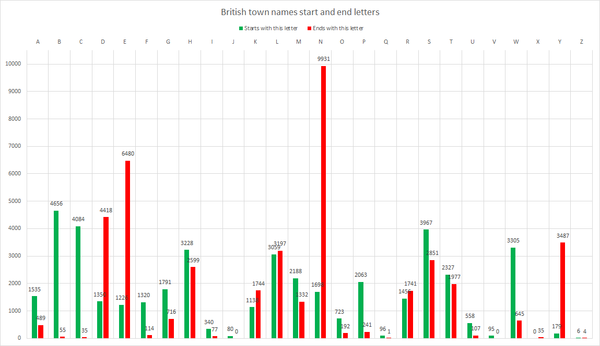

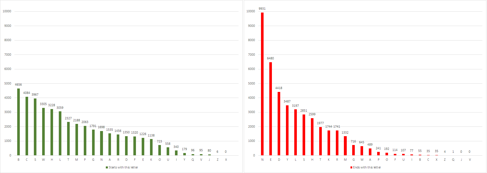

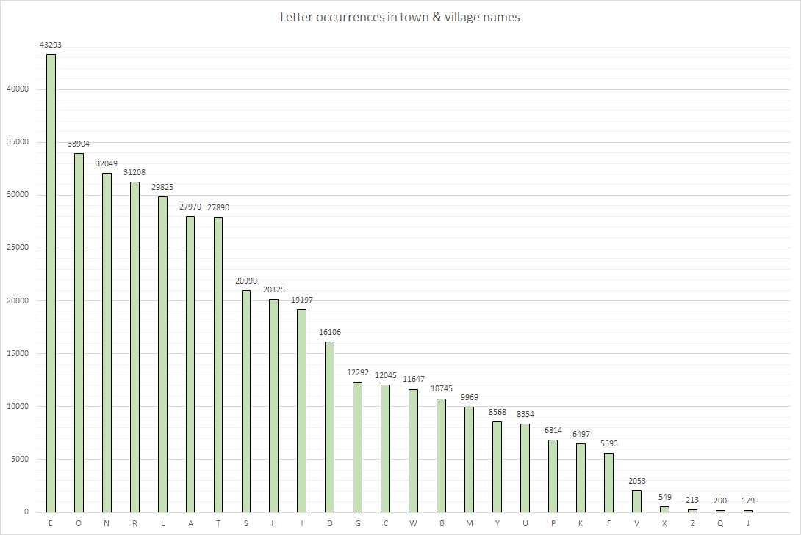

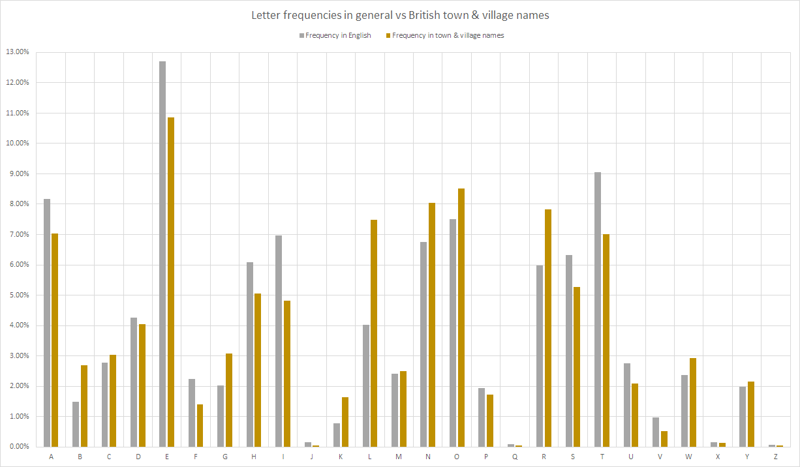

| Letter | Frequency in English | Frequency in town & village names | Difference | 
|--------|----------------------|-----------------------------------|------------| 
| A      | 8.17%                | 7.02%                             | -1.14%     | 
| B      | 1.49%                | 2.70%                             | 1.21%      | 
| C      | 2.78%                | 3.02%                             | 0.24%      | 
| D      | 4.25%                | 4.04%                             | -0.21%     | 
| E      | 12.70%               | 10.87%                            | -1.83%     | 
| F      | 2.23%                | 1.40%                             | -0.82%     | 
| G      | 2.02%                | 3.09%                             | 1.07%      | 
| H      | 6.09%                | 5.05%                             | -1.04%     | 
| I      | 6.97%                | 4.82%                             | -2.15%     | 
| J      | 0.15%                | 0.04%                             | -0.11%     | 
| K      | 0.77%                | 1.63%                             | 0.86%      | 
| L      | 4.03%                | 7.49%                             | 3.46%      | 
| M      | 2.41%                | 2.50%                             | 0.10%      | 
| N      | 6.75%                | 8.05%                             | 1.30%      | 
| O      | 7.51%                | 8.51%                             | 1.01%      | 
| P      | 1.93%                | 1.71%                             | -0.22%     | 
| Q      | 0.10%                | 0.05%                             | -0.04%     | 
| R      | 5.99%                | 7.84%                             | 1.85%      | 
| S      | 6.33%                | 5.27%                             | -1.06%     | 
| T      | 9.06%                | 7.00%                             | -2.05%     | 
| U      | 2.76%                | 2.10%                             | -0.66%     | 
| V      | 0.98%                | 0.52%                             | -0.46%     | 
| W      | 2.36%                | 2.92%                             | 0.56%      | 
| X      | 0.15%                | 0.14%                             | -0.01%     | 
| Y      | 1.97%                | 2.15%                             | 0.18%      | 
| Z      | 0.07%                | 0.05%                             | -0.02%     | 

## Most frequent n-grams per size

Note that spaces and dashes were removed in the names before creating n-grams.

| Mixed (1-8 letters) | 1 letter  | 2 letters | 3 letters  | 4 letters   | 5 letters    | 6 letters    | 7 letters     | 8 letters      | 
|---------------------|-----------|-----------|------------|-------------|--------------|--------------|---------------|----------------| 
| E (43293)           | E (43293) | ON (9067) | TON (6446) | REEN (1977) | GREEN (1962) | INGTON (867) | BOROUGH (179) | TONGREEN (113) | 
| O (33904)           | O (33904) | TO (8115) | ILL (2631) | GREE (1972) | NGTON (887)  | BRIDGE (563) | LINGTON (171) | LEYGREEN (111) | 
| N (32049)           | N (32049) | LE (6249) | REE (2571) | HILL (1715) | INGTO (873)  | LITTLE (494) | EYGREEN (143) | LLINGTON (96)  | 
| R (31208)           | R (31208) | ST (6213) | ING (2353) | STON (1438) | FIELD (812)  | SGREEN (441) | ONGREEN (135) | DDINGTON (91)  | 
| L (29825)           | L (29825) | EN (6061) | GRE (2313) | FORD (1126) | RIDGE (694)  | STREET (405) | DINGTON (133) | ERSGREEN (82)  | 
| A (27970)           | A (27970) | LL (5862) | EEN (2189) | WOOD (971)  | BRIDG (568)  | THORPE (350) | OUGHTON (117) | RRINGTON (66)  | 
| T (27890)           | T (27890) | OR (5583) | STO (2017) | ORTH (924)  | ITTLE (515)  | COMMON (341) | TONGREE (113) | NNINGTON (58)  | 
| S (20990)           | S (20990) | ER (5539) | LEY (1844) | GTON (902)  | LITTL (494)  | EGREEN (243) | LEYGREE (111) | MIDDLETO (57)  | 
| H (20125)           | H (20125) | RE (5335) | HIL (1839) | INGT (902)  | CROSS (451)  | CHURCH (212) | RINGTON (109) | CHURCHEN (52)  | 
| I (19197)           | I (19197) | TH (4794) | HAM (1520) | NGTO (898)  | SGREE (441)  | YGREEN (202) | NEWTOWN (99)  | ROUGHTON (52)  | 
| D (16106)           | D (16106) | IN (4606) | LAN (1481) | RTON (839)  | STONE (435)  | NGREEN (190) | HAMPTON (98)  | IDDLETON (52)  | 
| G (12292)           | G (12292) | AR (4442) | EST (1454) | IELD (831)  | HEATH (427)  | INGHAM (187) | LLINGTO (96)  | HURCHEND (51)  | 
| C (12045)           | C (12045) | HA (4404) | ORT (1381) | FIEL (812)  | STREE (411)  | OROUGH (179) | VILLAGE (92)  | HAMGREEN (47)  | 
| W (11647)           | W (11647) | AN (4271) | FOR (1332) | WEST (781)  | WORTH (410)  | BOROUG (179) | DDINGTO (91)  | INGFIELD (47)  | 
| B (10745)           | B (10745) | IL (3721) | END (1275) | IDGE (708)  | TREET (406)  | LINGTO (171) | RSGREEN (87)  | BROUGHTO (45)  | 
| M (9969)            | M (9969)  | EL (3455) | ORD (1214) | RIDG (703)  | NORTH (403)  | DGREEN (160) | LLGREEN (84)  | KINGSTON (44)  | 
| ON (9067)           | Y (8568)  | NG (3410) | RTH (1177) | LAND (646)  | LOWER (393)  | UGHTON (157) | ERSGREE (82)  | ONCOMMON (43)  | 
| Y (8568)            | U (8354)  | RO (3349) | ALL (1133) | TTLE (606)  | ERTON (382)  | NEWTON (156) | NINGTON (80)  | NORTHEND (43)  | 
| U (8354)            | P (6814)  | NE (3349) | WOO (1106) | TOWN (593)  | SOUTH (374)  | MIDDLE (148) | THWAITE (77)  | TONHEATH (41)  | 
| TO (8115)           | K (6497)  | EE (3318) | TRE (1030) | BRID (590)  | THORP (354)  | EYGREE (143) | ESTREET (72)  | WOODSIDE (40)  | 
| P (6814)            | F (5593)  | HE (3246) | TLE (1029) | THOR (585)  | HORPE (350)  | BOURNE (143) | INGSTON (69)  | ERSTREET (40)  | 
| K (6497)            | V (2053)  | LA (3237) | ELL (1028) | LTON (556)  | OMMON (341)  | AMPTON (138) | RRINGTO (66)  | TONCOMMO (38)  | 
| TON (6446)          | X (549)   | AL (3234) | OOD (1021) | WELL (555)  | COMMO (341)  | CORNER (136) | VINGTON (61)  | ILLINGTO (37)  | 
| LE (6249)           | Z (213)   | HI (3230) | AND (1015) | EATH (520)  | ESTON (334)  | ONGREE (135) | ESGREEN (61)  | OODHOUSE (35)  | 
| ST (6213)           | Q (200)   | EA (3190) | THE (1005) | ITTL (515)  | BROOK (319)  | DINGTO (133) | EBRIDGE (61)  | WOODHOUS (35)  | 
| EN (6061)           | J (179)   | ES (3182) | TER (962)  | EAST (513)  | UPPER (313)  | CASTLE (130) | WESTEND (61)  | CHARLTON (34)  | 
| LL (5862)           |           | ND (3044) | NGT (936)  | LLAN (506)  | ROUGH (297)  | OUGHTO (118) | MIDDLET (60)  | TONONTHE (34)  | 
| F (5593)            |           | CH (2912) | RTO (927)  | LITT (503)  | EHILL (260)  | TONGRE (115) | MINGTON (59)  | ALLGREEN (34)  | 
| OR (5583)           |           | GR (2845) | BUR (918)  | LING (496)  | GREAT (258)  | NETHER (114) | NNINGTO (59)  | INGGREEN (33)  | 
| ER (5539)           |           | RT (2762) | GTO (916)  | NORT (485)  | NEWTO (257)  | LEYGRE (111) | STHORPE (58)  | WOODLAND (33)  | 
| RE (5335)           |           | OW (2678) | AST (902)  | CROS (475)  | HOUSE (251)  | RINGTO (109) | LITTLEB (57)  | ONTHEHIL (33)  | 
| TH (4794)           |           | TE (2660) | ELD (900)  | TREE (475)  | COMBE (243)  | LGREEN (107) | TINGTON (57)  | NTHEHILL (33)  | 
| IN (4606)           |           | HO (2634) | EAT (891)  | ROSS (475)  | EGREE (243)  | SUTTON (100) | NBRIDGE (57)  | THORNTON (32)  | 
| AR (4442)           |           | CO (2593) | HOR (879)  | TONE (474)  | LLING (237)  | LLINGT (99)  | IDDLETO (57)  | ONBRIDGE (32)  | 
| HA (4404)           |           | EY (2593) | HEA (874)  | STRE (472)  | SHILL (234)  | EWTOWN (99)  | NSGREEN (55)  | NBOROUGH (32)  | 
| AN (4271)           |           | OO (2563) | BRO (871)  | HEAT (466)  | MPTON (233)  | NEWTOW (99)  | PRESTON (55)  | BUCKLAND (31)  | 
| IL (3721)           |           | AT (2505) | OWN (869)  | OWER (451)  | NHILL (224)  | HAMPTO (98)  | NCOMMON (55)  | LEYHEATH (31)  | 
| EL (3455)           |           | WE (2412) | IEL (860)  | OUGH (447)  | GHTON (219)  | HFIELD (95)  | LITTLEW (55)  | EYCOMMON (30)  | 
| NG (3410)           |           | BR (2375) | DGE (860)  | SGRE (443)  | HURCH (212)  | TFIELD (95)  | CHURCHE (55)  | LITTLETO (30)  | 
| RO (3349)           |           | SH (2351) | ERS (830)  | HALL (439)  | CHURC (212)  | HIGHER (92)  | DDLETON (54)  | CKINGTON (30)  | 

## Places containing n-grams

The quality of these is admittedly questionable.

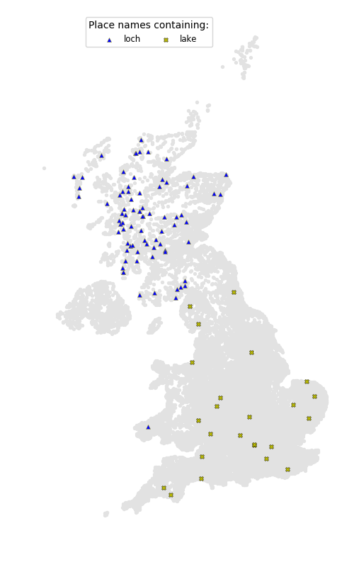

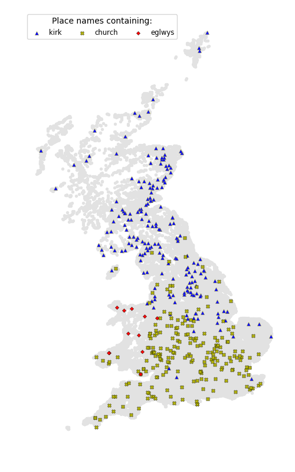

The [etymology of the word kirk](https://en.wikipedia.org/wiki/Kirk#Basic_meaning_and_etymology) is very interesting and explains why its usage stretches south not only into England but also [mainland Europe](https://en.wikipedia.org/wiki/Dunkirk#Etymology_and_language_use). It seems less that 'kirk' is a Scottish word and mostly that 'church' is an English word. The Old Norse influenced places may be in the more [Viking-riddled areas](https://en.wikipedia.org/wiki/Danelaw) of England.

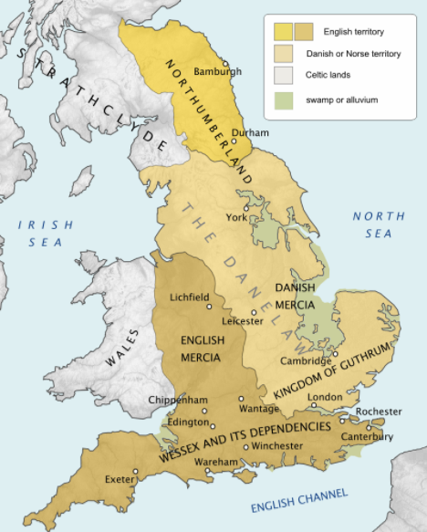
(Source: [Wikipedia](https://en.wikipedia.org/wiki/Danelaw)))

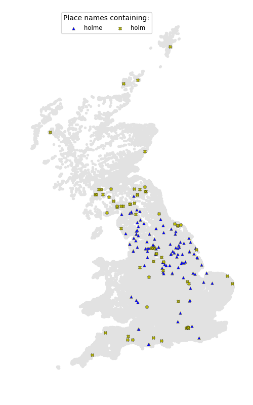

"Holm" - another Old Norse term that fits this pattern.

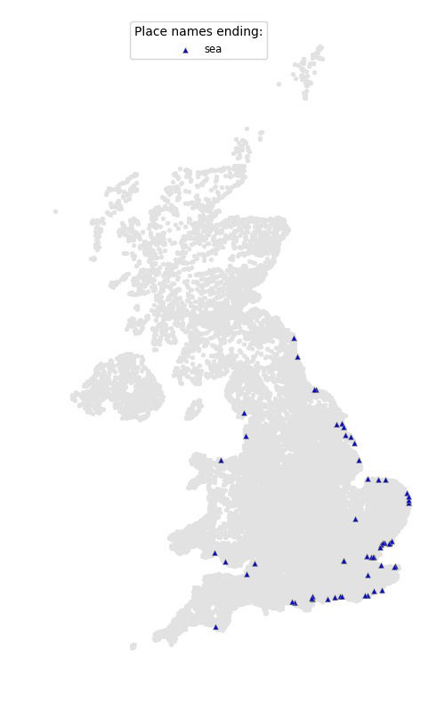

Few surprises here: a well-defined line is drawn around parts of the coast with place names mentioning the sea.

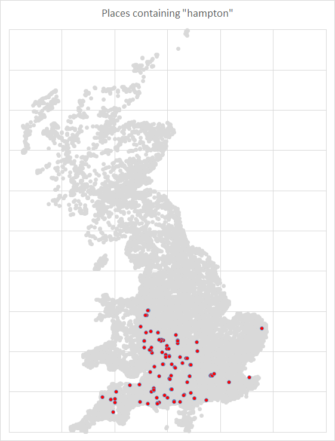

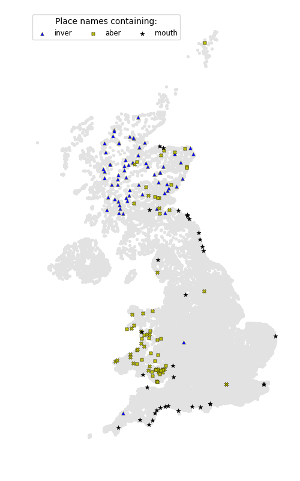

"Aber", "Mouth", and "Inver" all refer to river mouths. Interesting to note that "Aber" is shared between Scotland and Wales, while "Inver" is exclusively Scottish.

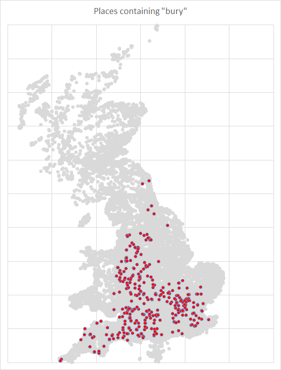

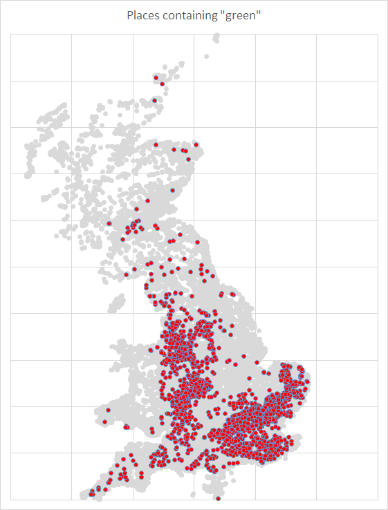

Terms "bury" and "green" mostly occupy non-Danelaw areas of England.

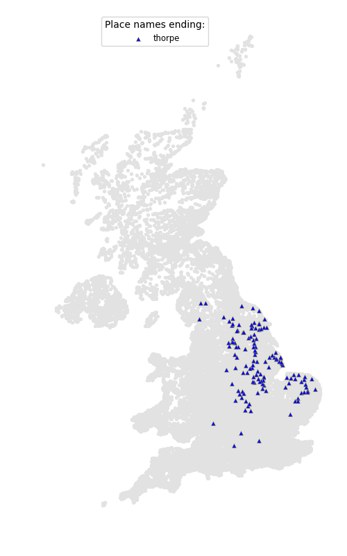

I suspect this to be [another Danelaw term](https://en.wiktionary.org/wiki/thorp#Etymology).

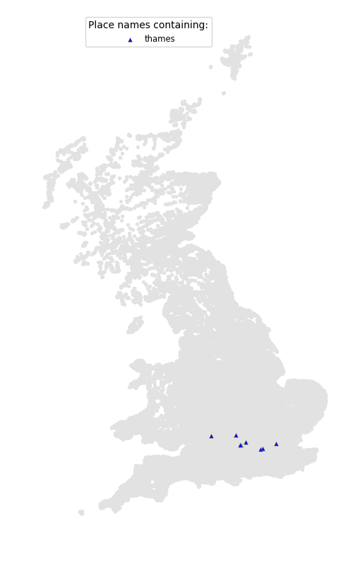

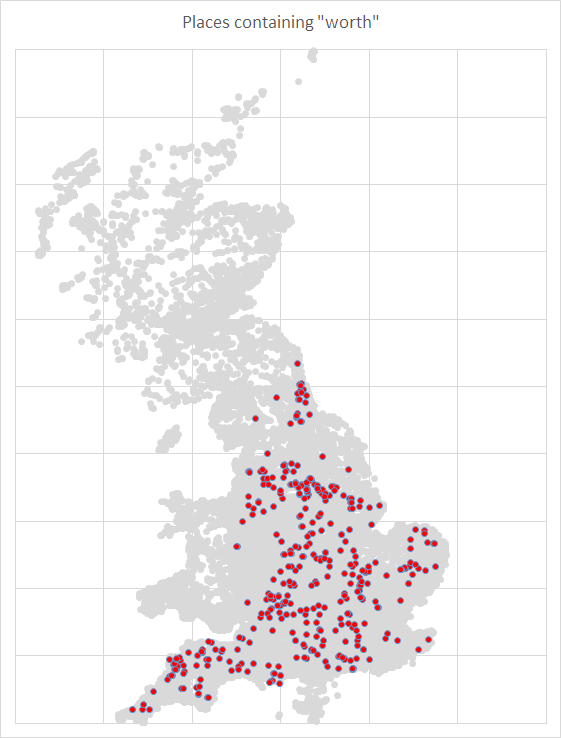

Interesting that "worth" is well spread over England but does not venture into Scotland or Wales - but makes more sense when you find that [its origin is Old English](https://en.wikipedia.org/wiki/List_of_generic_forms_in_place_names_in_the_United_Kingdom_and_Ireland).

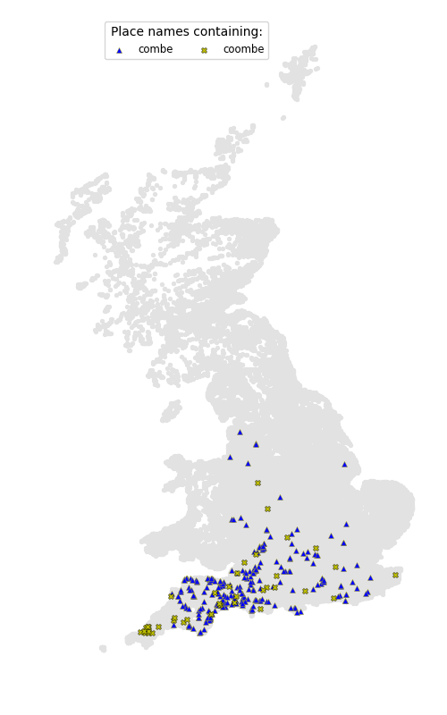

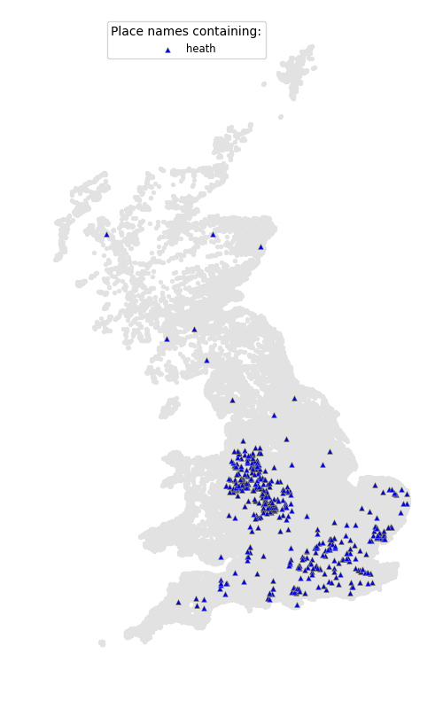

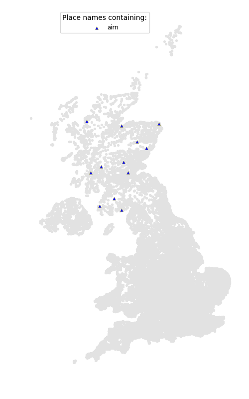

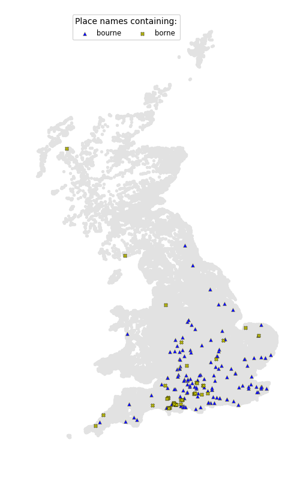