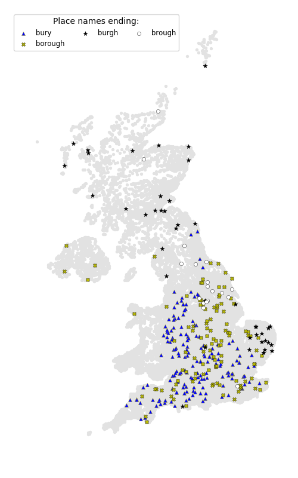
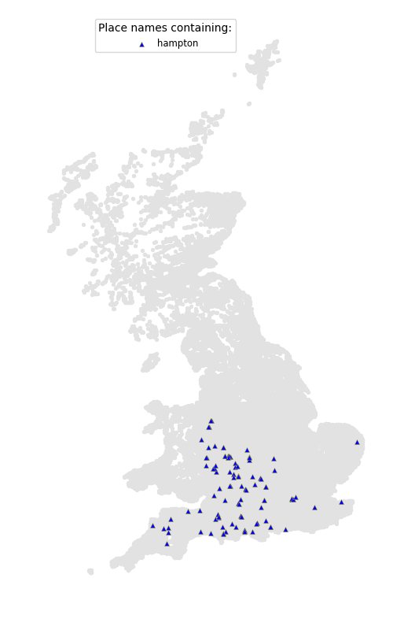
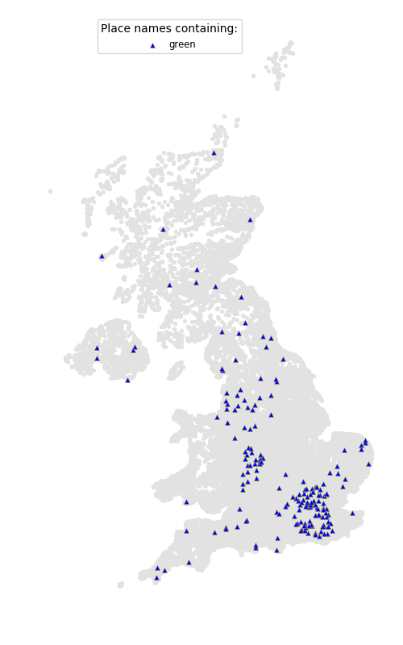
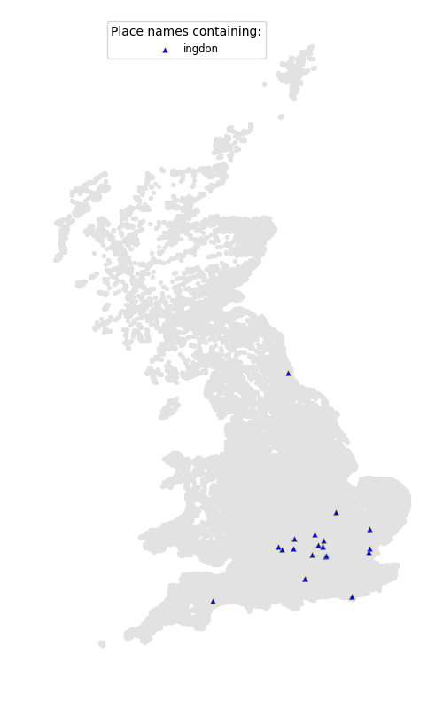
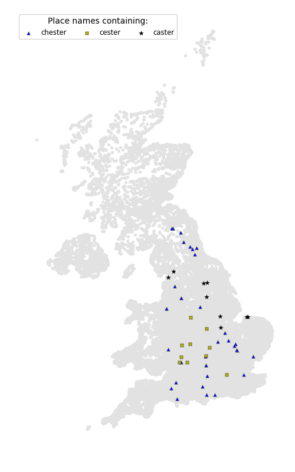
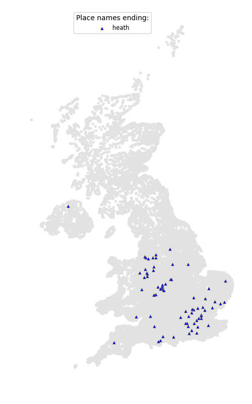
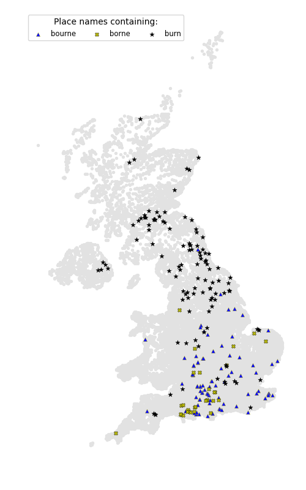
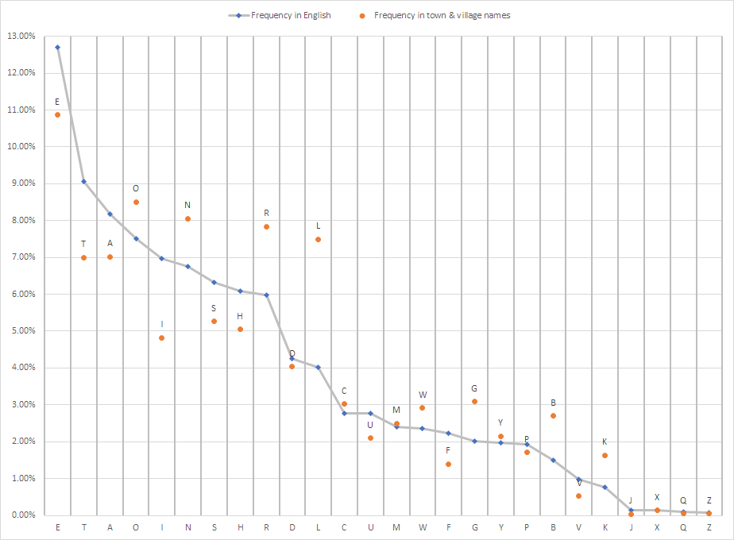
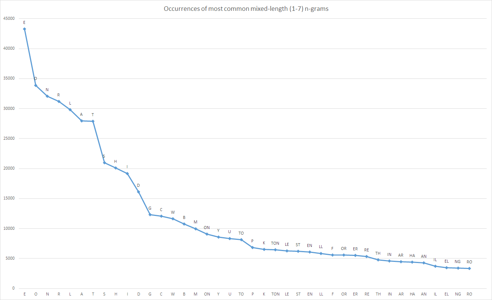
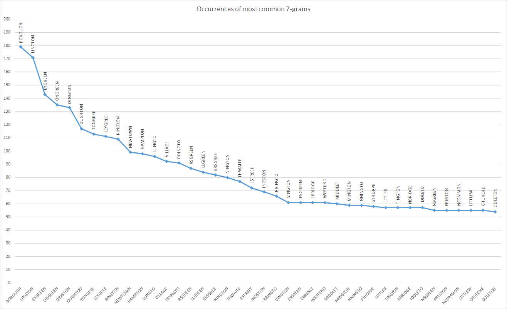

# TownsAndVillages

## Places containing n-grams

The quality of these is admittedly questionable.

The [etymology of the word kirk](https://en.wikipedia.org/wiki/Kirk#Basic_meaning_and_etymology) is very interesting and explains why its usage stretches south not only into England but also [mainland Europe](https://en.wikipedia.org/wiki/Dunkirk#Etymology_and_language_use). It seems less that 'kirk' is a Scottish word and mostly that 'church' is an English word. The Old Norse influenced places may be in the more [Viking-riddled areas](https://en.wikipedia.org/wiki/Danelaw) of England.

(Source: [Wikipedia](https://en.wikipedia.org/wiki/Danelaw))

"Holm" - another Old Norse term that fits this pattern.

Few surprises here: a well-defined line is drawn around parts of the coast with place names mentioning the sea.

"Aber", "Mouth", and "Inver" all refer to river mouths. Interesting to note that "Aber" is shared between Scotland and Wales, while "Inver" is exclusively Scottish.

"Green" appears to mostly occupy non-Danelaw areas of England.

I suspect this to be [another Danelaw term](https://en.wiktionary.org/wiki/thorp#Etymology).

Interesting that "worth" is well spread over England but does not venture into Scotland or Wales - but makes more sense when you find that [its origin is Old English](https://en.wikipedia.org/wiki/List_of_generic_forms_in_place_names_in_the_United_Kingdom_and_Ireland).

'Cester' seems like a southern variation, and 'caster' a northern variation. Uses of '[chester](https://en.wikipedia.org/wiki/Chester_(placename_element))' itself reach up to the [Antonine Wall](https://en.wikipedia.org/wiki/Antonine_Wall).

 (Source: [Wikipedia](https://en.wikipedia.org/wiki/Antonine_Wall))

## Frequency analysis

## Most frequent n-grams per size

Note that spaces and dashes were removed in the names before creating n-grams.

## Lengths of names

## Links

- 