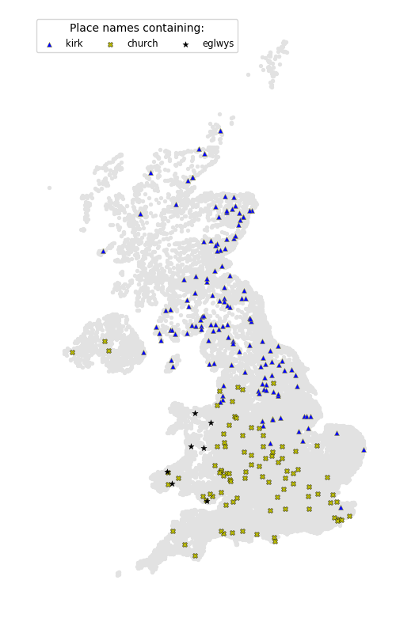
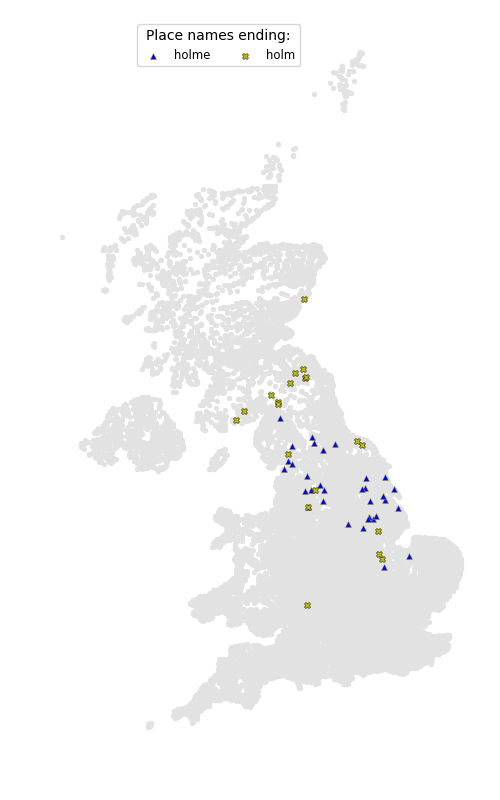
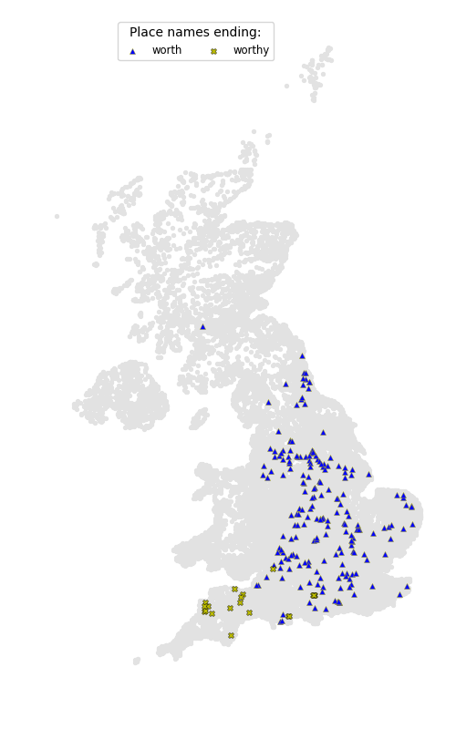
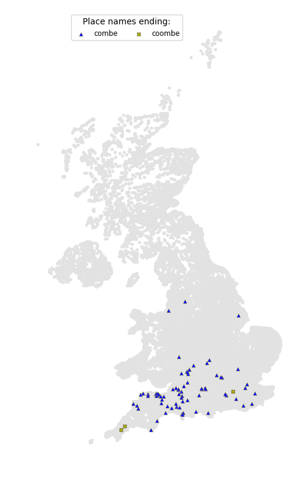
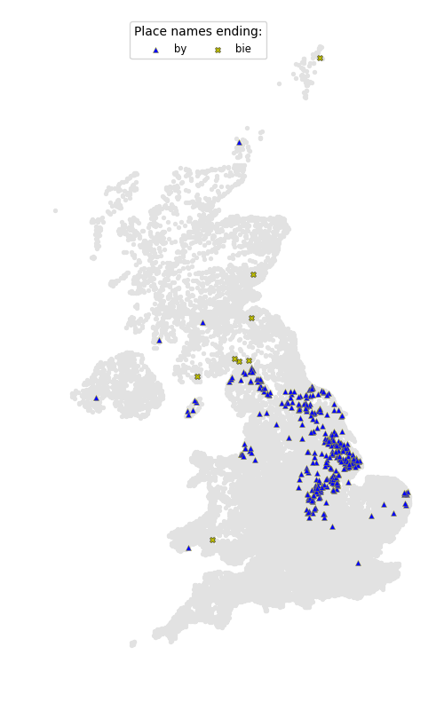
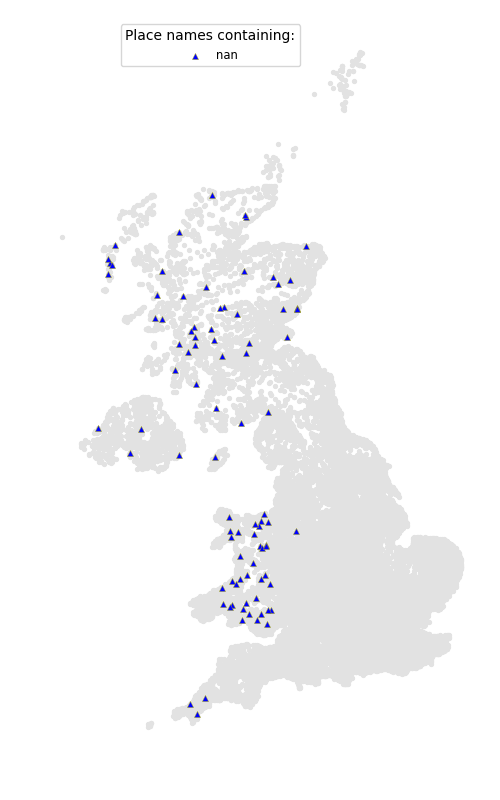
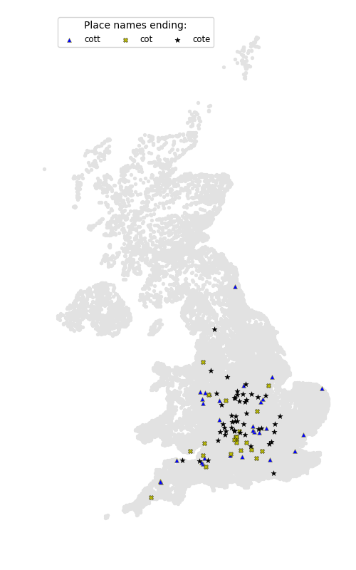
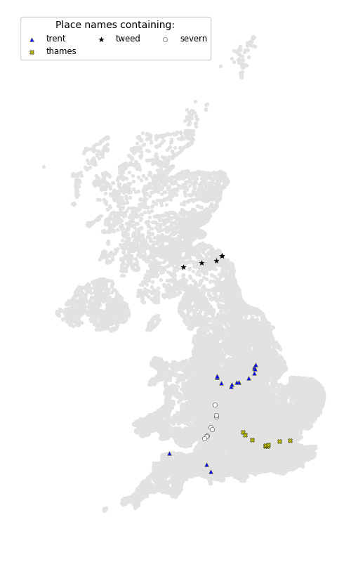
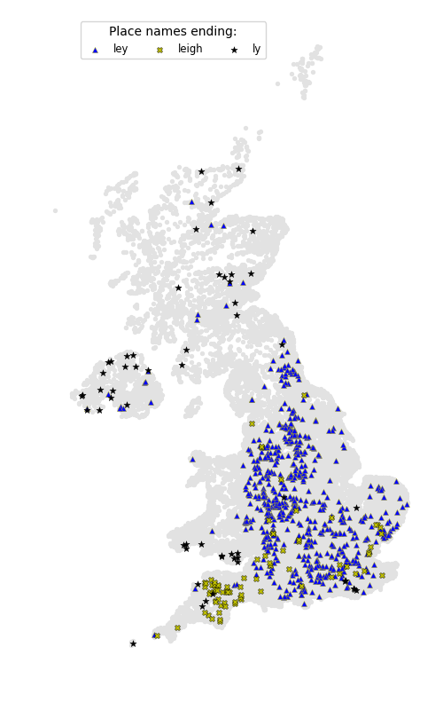
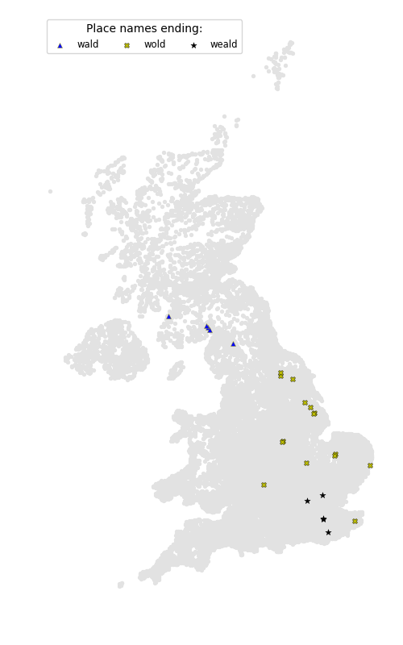

# British place names

## Contents
- [British place name component maps](https://github.com/DanielJohnBenton/TownsAndVillages#british-place-name-component-maps)
- [Most common dictionary words in British place names](https://github.com/DanielJohnBenton/TownsAndVillages#most-common-dictionary-words-in-british-place-names)
- [Letter frequencies in British place names](https://github.com/DanielJohnBenton/TownsAndVillages#letter-frequencies-in-british-place-names)
- [Most common British place name components per n-gram size](https://github.com/DanielJohnBenton/TownsAndVillages#most-common-british-place-name-components-per-n-gram-size)
- [Lengths of British place names](https://github.com/DanielJohnBenton/TownsAndVillages#lengths-of-british-place-names)
- [Interesting links](https://github.com/DanielJohnBenton/TownsAndVillages#interesting-links)
- [Acknowledgements](https://github.com/DanielJohnBenton/TownsAndVillages#thanks-to)
- [Technologies used](https://github.com/DanielJohnBenton/TownsAndVillages#technologies-used)

## British place name component maps

The quality of these is admittedly questionable.

The [etymology of the word kirk](https://en.wikipedia.org/wiki/Kirk#Basic_meaning_and_etymology) is very interesting and explains why its usage stretches south not only into England but also [mainland Europe](https://en.wikipedia.org/wiki/Dunkirk#Etymology_and_language_use). It seems less that 'kirk' is a Scottish word and mostly that 'church' is an English word. The Old Norse influenced places may be in the more [Viking-riddled areas](https://en.wikipedia.org/wiki/Danelaw) of England.

(Source: [Wikipedia](https://en.wikipedia.org/wiki/Danelaw))

"Holm" - another Old Norse term that fits this pattern.

Few surprises here: a well-defined line is drawn around parts of the coast with place names mentioning the sea.

"Aber", "Mouth", and "Inver" all refer to river mouths. Interesting to note that "Aber" is shared between Scotland and Wales, while "Inver" is exclusively Scottish.

"Green" appears to mostly occupy non-Danelaw areas of England.

I suspect this to be [another Danelaw term](https://en.wiktionary.org/wiki/thorp#Etymology).

Interesting that "worth" is well spread over England but does not venture into Scotland or Wales - but makes more sense when you find that [its origin is Old English](https://en.wikipedia.org/wiki/List_of_generic_forms_in_place_names_in_the_United_Kingdom_and_Ireland).

'Cester' seems like a southern variation, and 'caster' a northern variation. Uses of '[chester](https://en.wikipedia.org/wiki/Chester_(placename_element))' itself reach up to the [Antonine Wall](https://en.wikipedia.org/wiki/Antonine_Wall).

 (Source: [Wikipedia](https://en.wikipedia.org/wiki/Antonine_Wall))

Weald is [Old/Middle English for "wood"](https://en.wiktionary.org/wiki/weald#English).

## Most common dictionary words in British place names

[view full size](https://raw.githubusercontent.com/DanielJohnBenton/TownsAndVillages/master/images/common_dictionary_words.png)

Note: this list was heavily curated for the following reasons:
- The source dictionary list contains unhelpful (in this case) pieces like 'E', 'LL', 'ENL' which are mostly noise
- Single and double letter variations (e.g. 'A', 'EN') are mostly noise
- Some longer dictionary words like 'UGH' and 'EST' still don't really belong

However the raw, uncurated analysis data can be found [here](output/dictionary_word_occurrences_3lettersormore.txt).

## Letter frequencies in British place names

## Most common British place name components per n-gram size

Notes:
- Spaces and dashes were removed in the names before creating n-grams.
- The Y axis is on different scales in each graph.

## Lengths of British place names

## Interesting links
- [Toponymy in the United Kingdom and Ireland](https://en.wikipedia.org/wiki/Toponymy_in_the_United_Kingdom_and_Ireland) - Wikipedia
- [Toponymy of England - Languages](https://en.wikipedia.org/wiki/Toponymy_of_England#Languages) - Wikipedia
- [Mapping Vikings through British Isles Placenames](https://jalapic.github.io/vikings) - James Curley
- [List of generic forms in place names in the United Kingdom and Ireland](https://en.wikipedia.org/wiki/List_of_generic_forms_in_place_names_in_the_United_Kingdom_and_Ireland) - Wikipedia
- [The Zipf Mystery](https://www.youtube.com/watch?v=fCn8zs912OE) - Vsauce - YouTube
- [Old Norse and Norn names in Shetland](http://www.edinburghgeolsoc.org/edingeologist/z_39_08.html) - Edinburgh Geological Society
- [Glossary of Scandinavian origins of place names in Britain](https://www.ordnancesurvey.co.uk/resources/historical-map-resources/scandinavian-glossary.html) - Ordnance Survey
- [Talk of the town: The etymology of UK places](http://www.independent.co.uk/news/uk/this-britain/talk-of-the-town-the-etymology-of-uk-places-2277630.html) - The Independent
- [List of United Kingdom county name etymologies](https://en.wikipedia.org/wiki/List_of_United_Kingdom_county_name_etymologies) - Wikipedia

## Data sources
- Earlier Britain graphs created using the data from [Mike Simpson's Genealogy Site](http://freepages.genealogy.rootsweb.ancestry.com/~agene/locations/).
- More recent Britain graphs, and graphs for other countries, come from the data at [GeoNames](http://www.geonames.org/).

The data from Mike Simpson's site was filtered for 6-digit Ordnance Survey codes which were mostly towns and villages but did have some noise. The data included Britain and the Isle of Man. It was missing some villages I looked for such as Carsethorn and Colvend.

The GeoNames UK data includes Britain and Northern Island. It also appears to have some data from other time zones (territories?) so I filtered any timezone not Europe/London. Isle of Man data was combined in from a separate GeoNames data file. The GeoNames data appears to have less omissions and less noise. However, I have noticed some flaws. I have filtered this data by feature class "P" - populated places mostly cities, towns and villages, but with some noise remaining.

Between the two data sources the maps are more or less similar, with as a general rule less positions appearing for the GeoNames data, but in the same areas and clusters.

## Thanks to
- [UK Towns & Villages](http://freepages.genealogy.rootsweb.ancestry.com/~agene/locations/) - Mike Simpson's Genealogy Site
- [dwyl - english-words](https://github.com/dwyl/english-words) - 479k English wordlist
- [clipboardy](https://github.com/sindresorhus/clipboardy) - copy/paste library for Node.js
- [Matplotlib](https://matplotlib.org/) and [pandas](http://pandas.pydata.org/)
- [CSV to Markdown Table Generator](https://donatstudios.com/CsvToMarkdownTable) - Donat Studios
- [List of generic forms in place names in the United Kingdom and Ireland](https://en.wikipedia.org/wiki/List_of_generic_forms_in_place_names_in_the_United_Kingdom_and_Ireland) - Wikipedia
- [Sindre Sorhus on Stack Overflow](https://stackoverflow.com/questions/7778539/copy-to-clipboard-in-node-js/43153941#43153941) - Copy to clipboard in Node.js?
- [Ore4444 on Stack Overflow](https://stackoverflow.com/questions/9961502/is-there-a-way-to-automatically-build-the-package-json-file-for-node-js-projects/13728837#13728837) - Is there a way to automatically build the package.json file for Node.js projects

## Technologies used
- Code in JavaScript/Node.js and Python
- Third-party libraries (JS): [clipboardy](https://github.com/sindresorhus/clipboardy)
- Third-party libraries (Python): [Matplotlib](https://matplotlib.org/), [pandas](http://pandas.pydata.org/)
- Graphs made using Microsoft Excel or Matplotlib